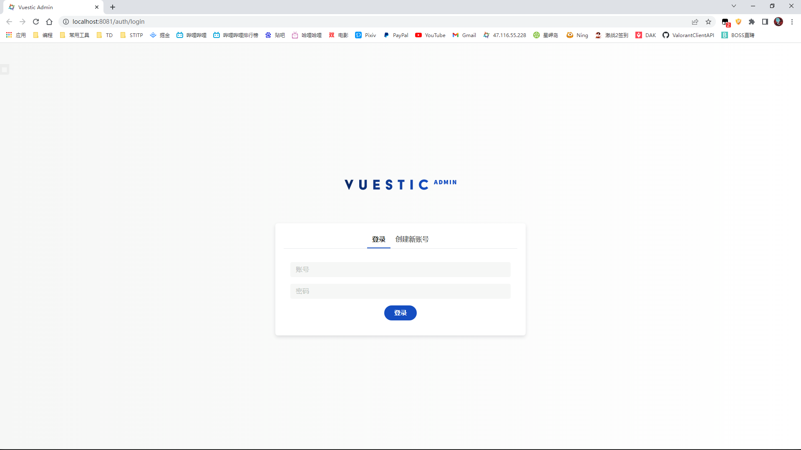
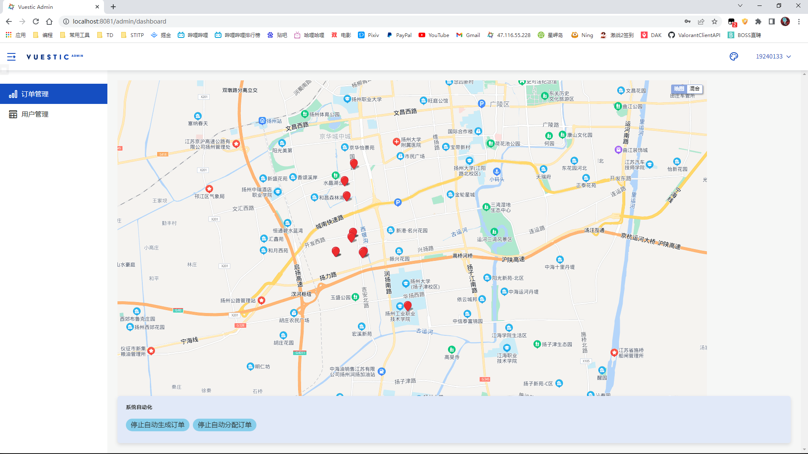
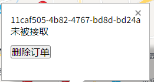
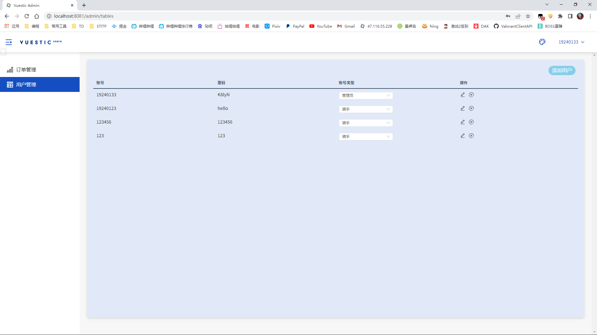
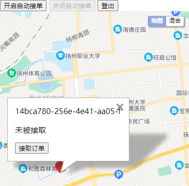
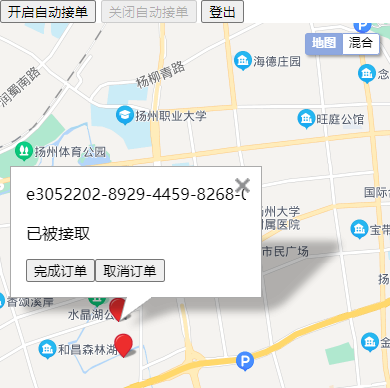
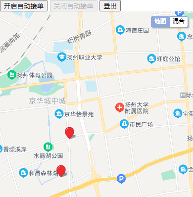
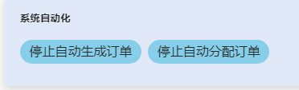
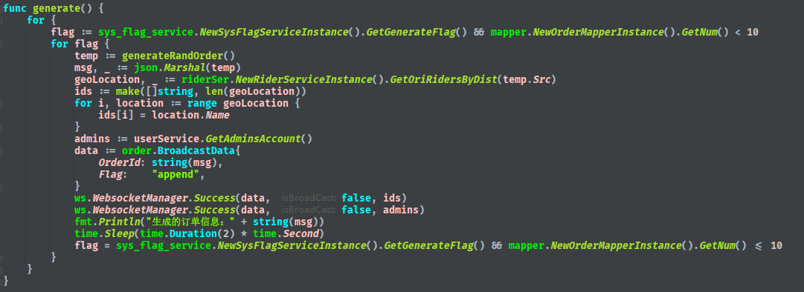
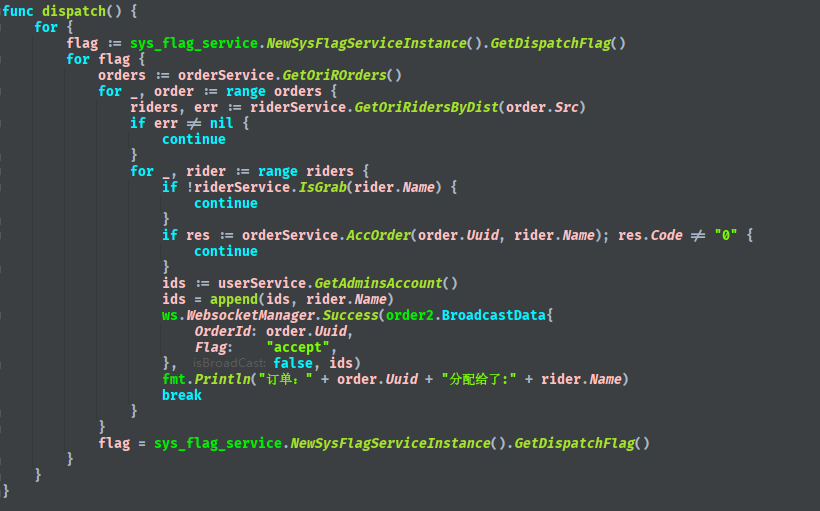

# 简介  

本系统是一个简易的抢单系统，包括自主抢单以及系统自动分配订单。

本系统后端使用go语言的gorm和gin框架进行开发，后台管理系统使用vuestic-ui的公开模版修改而得。地图部分使用的是百度地图API。运行前需向百度地图API申请ak并拼接到前端入口当中。

订单自动分配逻辑为计算订单发出地一定范围内（为方便演示为3km）所有的在线骑手位置，将该订单自动分配给最近的骑手。

前后端使用WebSocket进行订单信息的通信以及时更新前端页面。

本系统未对一些安全方面的因素进行考虑，比如订单的超卖。

# 项目展示  

 管理员界面登陆页面：  管理员账号由此入口登录。

  

订单管理页面：  可以查看所有订单并删除指定订单，还可以开启系统自动生成订单以及自动分配订单功能。  
  

订单管理详情：  订单详情显示订单是否被接取，还可通过按钮直接删除订单。  

  

用户管理页面：  可以查看所有用户、修改用户密码、用户类型、添加以及删除用户。

骑手登录页面：
  

骑手订单详情页：  骑手可通过按钮开启或结束抢单和主动登出。  同时，订单锚点显示该订单状态以及接单按钮，如图1。  在接单完成后，订单详情会更改，如图2。  在完成订单后，订单会在订单详情页消失，如图3。

    图1 

    图2         

    图3  

  

  
  

管理员通过按钮开启自动生成订单后，系统会用随机函数生成订单发出地的经纬度和订单送达地的经纬度，然后用生成的UUID作为订单名作为订单。通过geohash计算出订单发出地三公里以内的所有骑手用户，再通过WebSocket通知所有的管理员账号以及计算出的骑手用户，以更新前端页面。

  

管理员开启分配订单后，系统会自动遍历所有的订单，每个遍历到的订单会依次检索三公里范围内的骑手，如果该骑手处于抢单状态中则将本订单分配给该骑手。分配完成后，结束检索骑手，继续遍历下一订单。
